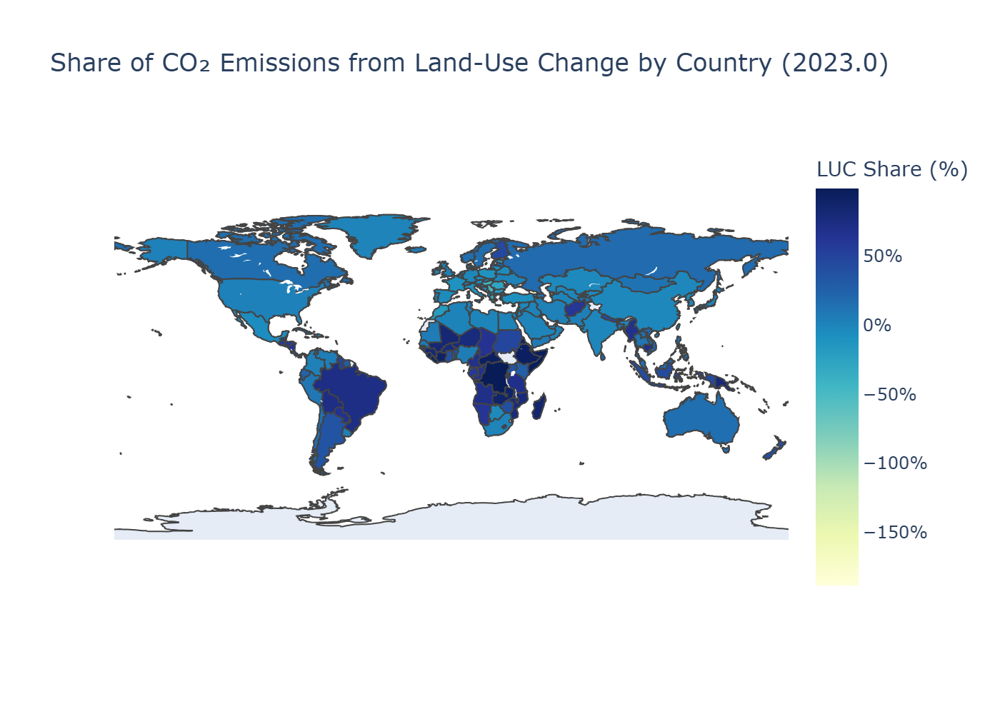

# GLOBAL HEAT & POLAR RETREAT: TRACKING EMISSIONS, TEMPERATURES, AND ARCTIC CHANGE

---

## Overview
Climate change is reshaping the planet at an unprecedented pace, with rising greenhouse gas emissions driving both global temperature increases and rapid Arctic decline. This project brings together over 270 years of emission records, historical temperature datasets, and detailed Arctic observations to uncover how human activity has altered Earth’s climate system. By analyzing global drivers and polar responses side by side, the study provides a clearer picture of cause-and-effect linkages between carbon emissions and environmental change. The integration of statistical methods with forecasting models highlights not just past trajectories but also the potential future states of the climate system. Together, these insights contribute to both scientific understanding and actionable knowledge for climate policy.

---

## Objective
The objective of this research is to evaluate the extent to which carbon dioxide emissions influence global temperatures and Arctic sea ice conditions. Specifically, the project investigates the direct correlation between emissions and warming, while also assessing how these changes manifest in polar regions. A focus is placed on identifying key emission sources, such as major economies, fossil fuel use, and land-use change, to understand patterns of responsibility. Parallel to this, Arctic datasets are used to examine seasonal cycles, long-term decline, and climate drivers shaping ice loss. Forecasting models are then applied to estimate when the Arctic could reach “ice-free” conditions, defined as less than one million km² of summer sea ice. By combining these perspectives, the project provides a robust, data-driven foundation for understanding global warming and its polar consequences.

---

## Methodology

### A) Dataset Sources

* **Temperature:** [Temperature](https://berkeleyearth.org/data/)
* **CO₂ Concentrations, Energy & Emissions:** [Co2 Emissions & Energy](https://globalcarbonbudgetdata.org/latest-data.html)
* **Arctic Sea Ice Single Levels:** [ERA5_single_levels](https://cds.climate.copernicus.eu/datasets/reanalysis-era5-single-levels-monthly-means?tab=overview)
* **Arctic Sea Ice thickness:** [arctic_ice_thickness](https://psc.apl.washington.edu/zhang/Global_seaice/data.html)
* **Arctic Sea Ice Area:** [arctic_ice_area](https://search.dataone.org/view/doi%3A10.18739%2FA2CC0TV9V#urn%3Auuid%3A2dffb930-b993-4a58-8d5a-b432f4de45c3)

### B) Data Collection & Preprocessing

To unify datasets of different formats and time scales, we designed a multi-stage pipeline:

#### 1. Raw Data
Raw data was stored in `data/raw/` and included:  
- **Tabular files** (`.csv`, `.xlsx`, `.txt`) for global emissions, temperature, and energy supply.  
- **NetCDF files** (`.nc`) for Arctic-specific variables including:  
  - Sea ice area (SIA) and sea ice extent (SIE).  
  - Sea ice thickness (PIOMAS).  
  - ERA5 predictor variables (air temperature, sea surface temperature, skin temperature, snow, cloud cover, solar radiation, UV radiation, latent/sensible heat fluxes).  

#### 2. Pre-Processing
The raw datasets were transformed into structured, analysis-ready `.csv` files under `data/pre_processed/` using the notebooks in `scripts/pre_processing/`. Key steps:  

- **CO₂ and Energy**  
  - `co2_source.ipynb`: Cleaned and extracted CO₂ emissions by country, sector, and fuel type.  
  - `ei_process_energy_supply.ipynb`: Processed global energy mix and supply datasets.  

- **Global Temperature**  
  - `global_temp.ipynb`: Standardized Berkeley Earth data into annual anomalies.  

- **Arctic Sea Ice**  
  - `arctic_area_extent.ipynb`: Converted NSIDC `.nc` records of sea ice area and extent into monthly/annual CSVs.  
  - `arctic_thickness.ipynb`: Extracted PIOMAS thickness data from NetCDF into long-term timeseries.  
  - `arctic_predictors.ipynb`: Processed ERA5 NetCDF datasets (temperature, SST, radiation, fluxes, snowfall, cloud cover) into predictor time series.  

- **Merging**  
  - `whole_data_merge.ipynb`: Merged CO₂, energy, and temperature into a global-scale dataset.  
  - `arctic_final_merge.ipynb`: Combined sea ice metrics (area, extent, thickness) with predictor variables into a single Arctic dataset.  

#### 3. Final Datasets
Two key datasets were produced:  
- **`final_arctic.csv`** - Comprehensive Arctic dataset (SIA, SIE, thickness, plus predictors like SST, fluxes, radiation, snow).  
- **`whole_data_merged.csv`** - Integrated global dataset (CO₂, energy, and Global Temperature).  

These final datasets allowed seamless exploratory analysis, correlation studies, and forecasting models. NetCDF processing ensured high-resolution Arctic climate data was aligned with long-term global records.

### C) Analysis & Modelling

#### Part 1 - CO₂ Emissions & Global Temperature
Carbon dioxide has been the central anthropogenic driver of global warming since the Industrial Revolution. Its concentration in the atmosphere has grown alongside fossil fuel combustion, cement production, and land-use change. The relationship between CO₂ and global temperature is not only strong but also statistically robust, showing that human activity is the dominant force shaping Earth’s climate trajectory. To understand this fully, it is essential to examine how emissions have grown over time, which countries and fuels are most responsible, and how trade and land-use further complicate accountability.

##### 1.1 CO₂-Temperature Link
<div align="center">
  
</div>  
The tight correlation between atmospheric CO₂ and global temperature anomalies demonstrates the causal link at the core of climate change. Even with natural variability and uncertainty, the long-term pattern is clear: as CO₂ rises, so does temperature. The strongest accelerations in both series coincide with industrial expansion and increased fossil fuel dependency, confirming the anthropogenic signal.

##### 1.2 Top Emitters Over Time
<div align="center">
  
</div>  
National trajectories show the changing geography of responsibility. China has become the largest emitter in the 21st century, overtaking the United States, whose emissions have plateaued but remain historically high. India’s rapid growth highlights the challenge of balancing development with sustainability, while Russia and Japan reflect more stable but persistent contributions.

##### 1.3 Fuel Breakdown
<div align="center">
  
</div>  
Breaking emissions down by fuel type reveals the structural drivers of carbon growth. Coal continues to dominate, particularly in emerging economies, while oil and natural gas provide additional momentum. Cement and industrial processes add a smaller but steady share, underscoring that carbon is embedded not just in energy but also in infrastructure.

##### 1.4 Trade-Adjusted Emissions
<div align="center">
  
</div>  
Production-based emissions underestimate the role of wealthy consumer economies. When adjusted for trade, developed regions such as Europe and North America import substantial amounts of “hidden” carbon through goods manufactured elsewhere. This highlights how carbon responsibility is globally interconnected, with production concentrated in exporters like China but consumption-driven elsewhere.

##### 1.5 Land-Use Change
<div align="center">
  
</div>  
While fossil fuels dominate globally, land-use change remains critical in certain regions. Deforestation, agriculture, and land conversion in South America and Africa account for a disproportionate share of emissions locally. Although smaller in the global total, land-use emissions highlight the importance of ecosystem management in climate mitigation strategies.

#### Part 2 - Arctic Change: State, Drivers & Forecast
The Arctic is one of the fastest-changing regions on the planet, warming nearly two times faster than the global average. Sea ice decline is among the most visible indicators, reshaping ecosystems, weather systems, and geopolitical dynamics. Observing Arctic change provides not only a regional narrative but also a planetary warning, as feedbacks from this region reverberate globally. To understand this process, we must compare Arctic and global warming, analyze ice trends and seasonality, identify key drivers, and forecast future trajectories.

##### 2.1 Arctic Amplification vs Global
<div align="center">
  
</div>  
Arctic temperatures have diverged sharply from the global mean since the 1980s. This amplification stems from feedbacks such as albedo loss, where melting ice exposes darker surfaces that absorb more heat. The result is a self-reinforcing cycle of regional warming that not only accelerates ice loss but also alters atmospheric and oceanic circulation globally.

##### 2.2 Yearly Ice Decline
<div align="center">
  
</div>  
Long-term sea ice records confirm a steep and accelerating decline in yearly averages. Breakpoints in 2007 and 2012 mark historic lows, reshaping the baseline of Arctic conditions. Each decade since the 1980s has been consistently lower than the last, underscoring the permanence of the trend.

##### 2.3 Seasonal Cycle
<div align="center">
  
</div>  
Despite overall decline, the Arctic retains a clear seasonal rhythm. Ice reaches its maximum in late winter and its minimum in late summer, but the gap between the two has widened over time. The diminishing summer minima are particularly concerning, as they drive many of the feedback loops tied to Arctic amplification.

##### 2.4 Climatic Drivers
<div align="center">
  
</div>  
Correlation analysis highlights the key variables influencing sea ice decline. Sea surface temperature shows the strongest negative relationship, followed by air and skin temperature. Variables like snowfall and cloud cover play lesser roles. Identifying these drivers provides the foundation for forecasting models that capture both physical mechanisms and statistical dependencies.

##### 2.5 Forecasting with SARIMAX
<div align="center">
  
</div>  
SARIMAX was selected to forecast Arctic sea ice because it captures both autoregressive patterns and strong seasonal cycles better than simple ARIMA models. Unlike machine learning models such as LSTM, SARIMAX is transparent, interpretable, and works well with limited historical data. The model projects that the Arctic could see its first ice-free summer in the 2042, marking a profound shift in the Earth system. This choice balances accuracy with interpretability, making the forecasts more useful for climate communication and policy.


## Conclusion
The analysis shows how rising CO₂ emissions, driven largely by fossil fuels and concentrated in major economies, are tightly linked to global warming. Trade and land-use change complicate simple national responsibility, emphasizing the global nature of carbon flows. In the Arctic, amplification has accelerated sea ice decline, reshaped seasonal cycles, and revealed strong linkages with key climate variables. Forecasting with SARIMAX underscores the likelihood of an ice-free summer in the mid-21st century, providing both a stark warning and a benchmark for action. Together, these findings connect human activity to polar change in a clear narrative, demonstrating the urgency of reducing emissions and preparing for the cascading consequences of a warming Arctic.

---

## Future Scope  

This project establishes clear links between CO₂ emissions, global warming, and Arctic sea ice decline. Future work could extend these insights in several directions:  

- **Broader Greenhouse Gas Coverage**: Expand analysis to include methane (CH₄) and nitrous oxide (N₂O), which also contribute significantly to radiative forcing.  
- **Higher-Resolution Arctic Forecasting**: Apply deep learning models (e.g., LSTM, Transformers) alongside SARIMAX to capture nonlinear dynamics in sea ice variability.  
- **Coupled Climate Indicators**: Integrate ocean circulation indices (e.g., AMOC, ENSO, NAO) to better understand teleconnections influencing Arctic change.  
- **Scenario-Based Simulations**: Model emissions and Arctic ice loss under different policy pathways (e.g., IPCC Shared Socioeconomic Pathways).  
- **Interactive Dashboards**: Build a visualization platform for policymakers and the public to explore emissions, temperature anomalies, and Arctic forecasts interactively.  

---

## Project Structure

```
project-acm40960-ss/
│
├── data/
│   ├── final/
│   │   ├── final_arctic.csv
│   │   ├── whole_data_merged.csv
│   ├── pre_processed/
│   │   ├── arctic_sia_sie_monthly.csv
│   │   ├── co2&energy_merged.csv
│   │   ├── ei_energy_supply.csv
│   │   ├── era5_arctic_merged_clean.csv
│   │   ├── global_temp_data.csv
│   │   └── ...
│   └── raw/
│       ├── Fossil CO2 emissions.csv
│       ├── Global_TAVG_annual.txt
│       ├── National_Fossil_Carbon_Emissions_...
│       └── ...
│
├── scripts/
│   ├── analysis_and_modelling/
│   │   ├── arctic_vs_global_temp.ipynb
│   │   ├── co2_analysis.ipynb
│   │   ├── co2vstemp&energy_world.ipynb
│   │   ├── final_arctic_analysis.ipynb
│   │   ├── global_correlation.ipynb
│   │   ├── models.ipynb
│   │   └── temp_analysis.ipynb
│   └── pre_processing/
│       ├── arctic_area_extent.ipynb
│       ├── arctic_final_merge.ipynb
│       ├── arctic_predictors.ipynb
│       ├── arctic_thickness.ipynb
│       ├── co2_source.ipynb
│       ├── ei_process_energy_supply.ipynb
│       ├── global_temp.ipynb
│       └── whole_data_merge.ipynb
│
├── README.md
└── ...
```

## Installation & Usage

1. Clone this repository:

   ```bash
   git clone https://github.com/ACM40960/project-acm40960-ss.git
   cd project-acm40960-ss
   ```
2. Install dependencies:

   ```bash
   pip install -r requirements.txt
   ```
3. Open Jupyter notebooks in the `scripts/` directory for analysis and modeling.

---

## License  

This project is released under a **Custom Modified Creative Commons Attribution–NonCommercial 4.0 (CC BY-NC 4.0) License with Additional Restriction**.  

- Academic and research use is permitted with proper credit to the authors.  
- Commercial use or redistribution outside of academic/research purposes requires explicit written permission.  
- For full details, see the [LICENSE.txt](./LICENSE.txt) file.  

### Dataset Licensing  
This repository uses publicly available datasets from Berkeley Earth, Global Carbon Budget, Copernicus ERA5, PIOMAS, and NSIDC.  
All datasets remain under their respective licenses and must be used in accordance with their original terms. Attribution to the original data providers is required.  

---

## References  

1. Intergovernmental Panel on Climate Change (IPCC). (2021). *Climate Change 2021: The Physical Science Basis*. Chapter 3: Human Influence on the Climate System. In *The Sixth Assessment Report of the Intergovernmental Panel on Climate Change*. [Cambridge University Press.](https://www.ipcc.ch/report/ar6/wg1/)  

2. Jarvis, A., & Forster, P. M. (2024). [*Estimated human-induced warming from a linear temperature and atmospheric CO₂ relationship*. *Nature Geoscience, 17*, 1222–1224.](https://doi.org/10.1038/s41561-024-01580-5)  

3. Su, Z. (2022). [*World CO₂ Emissions: Simple Analysis and its Relationship with Global Temperature Change*. *Highlights in Science, Engineering and Technology, 25*, 21–36.](https://doi.org/10.54097/hset.v25i.3415)  

4. *ERA5 monthly averaged data on single levels from 1940 to present*. [Copernicus Climate Change Service (C3S) Climate Data Store (CDS).](https://cds.climate.copernicus.eu/datasets/reanalysis-era5-single-levels-monthly-means?tab=overview)

---

## Authors

- [@Sumukh Dulipet Sudhanva](https://github.com/SUMUKHDS)  
  📧 sumukhdsds@gmail.com | sumukh.dulipetsudhanva@ucdconnect.ie  

- [@Sathvik Gaurav Srinath](https://github.com/GS-Sathvik)  
  📧 sathviksgs@gmail.com | sathvik.gaurav@ucdconnect.ie  
